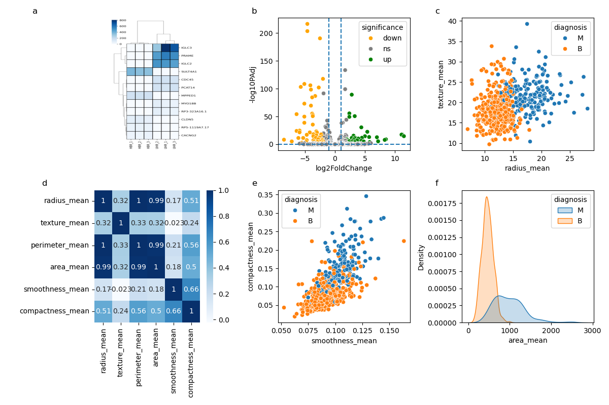

My submission(as part of Team Phenylalanine) for Stage 1 of HackBio internship. 

For this stage, I generated:

1) Python functions to perform hamming distance between 2 strings(Slack username and X username) or translate protein, both based on user input. 

2) Python code to replicate a figure panel based on meta-analysis of human tissue:

**Part A – Gene Expression Analysis(panels a-b)**
*Samples: HBR (Human Brain Reference) and UHR (Universal Human Reference) samples. HBR and UHR consist of gene expression data from Normal human brain or various cancer tissues, respectively.*
*Goal: examining gene expression between normal and cancer tissue.*

**Part B – Breast Cancer Data Exploration(panels c-f)**
*Samples: Wisconsin Breast Cancer Database(WDBC)- contains breast cancer images classified as Malignant(M) or Benign(B), based on 30 numerical features.* 
*Goal: Compare qualitative features between benign and malignant Breast cancer samples.* 

**Figures**

*a. Heatmap- Clustered heatmap of the top differentially expressed genes based on the normalized counts between HBR and UHR.*
*b. Volcano Plot- log2FoldChange vs log10(Padj) from the differential lyexpressed genes on chromosome 22 between UHR and HBR samples.*
*c. Scatter Plot- (radius vs texture), colored by diagnosis (M = malignant, B = benign).*
*d. Correlation Heatmap- Heatmap of correlation matrix(plus annotation) of six key features: radius_mean, texture_mean, perimeter_mean, area_mean, smoothness_mean, compactness_mean.*
*e. Scatter Plot- Compactness_mean vs smoothness_mean colored by diagnosis.*
*f. Density Plot- Kernel density estimates (KDE) of area_mean for Malignant(M) and Benign(B) samples*

**Findings**
Part A- Generated many differentially expressed genes that are visibly altered in UHR(Cancer) vs HBR(normal tissue).

Part B- There is a strong correlation between many of the features in the WDBC, especially between perimeter, area, and radius means.  A distinct distribution profile was observed between Malignant vs Benign for area mean.

